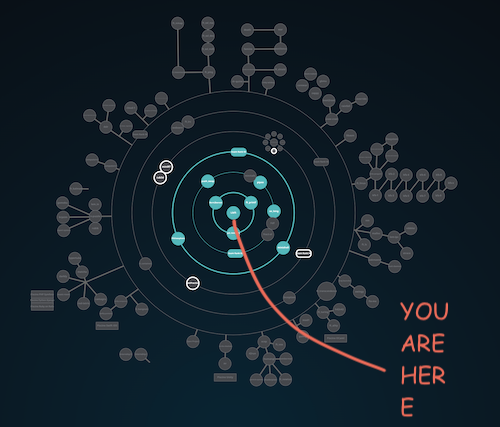

🔔 **Before you start** 🔔  
> *This project is part of the [42 computer programming schools](https://www.42network.org/) common-core curriculum. 42 is a non-profit educational organization characterized by its peer-to-peer and project-based learning method. You'll find a [subject](en.subject.pdf) of the project in the repository.* 
---

# 🗃️ Libft-prime

### Table of Contents

- [🛫 Intro ](#-intro)
- [✨ Characteristics](#-characteristics)
- [🛠️ Tools used](#️-tools-used)
- [🚀 Quick guide](#-quick-guide)
- [🎨 Bonus](#-bonus)
- [📖 Training report](#-training-report)
- [🏆 Acquired skills](#-acquired-skills)
- [🔧 Future improvement and/or next steps](#-future-improvement-andor-next-steps)
- [🤝 Acknowledgements](#-acknowledgements)
- [📚 References](#-references)

## 🛫 Intro

This project is the beginning for every person that starts their adventure at 42. The goal is to familirize one self with various concepts related to programming, as well as mimicing the behaviour of some of the functions from the [libc](https://en.wikipedia.org/wiki/C_standard_library).

Although many people that heard about this project think there is no need to reinvent the wheel, I have found that this project helped me understand the C programming language and its use in Linux in a way that 42-outsiders don't.

## ✨ Characteristics

- The code follows the [42 Norm](https://github.com/42School/norminette/blob/master/pdf/en.norm.pdf) standard
in accordance with the 42 evaluation criteria.

- This program has been tested on Linux and macOS.

## 🛠️ Tools used

The headers used for the permitted functions:

| Header File  | Libft            | get_next_line/ft_printf                   |
|--------------|------------------|-------------------------------------------|
| `stdlib.h`   | `free`, `malloc` |                                           |
| `unistd.h`   | `write`          | `read`                                    |
| `stdarg.h`   |                  | `va_start`, `va_arg`, `va_copy`, `va_end` |

## 🚀 Quick guide

The first thing you must do is clone the repository. Upon running make, a static library should be created in `bin`.

## 🎨 Bonus

This repository is a bonus in itself. It is the extended version of the libft project, meaning it has several functions not originally from the project, but that I have been using throughout the cursus. Among the new utilities you can find:

- More complex and refined functions for alphabetical to numerical data type transformations.
- Some bool-returning functions that check strings for specific expressions.
- Size 4 matrix operands.
- Operands for tuples, points and vectors.
- A new `ft_printf` called `printfd` that takes the fd for the output as first argument.
- New functions to manage string arrays (`split`).
- Transformations using matrices. These are applied to the `s_tpl` struct.
- Linked lists as the proposed bonus.

## 📖 Training report

This project acompanies you throught the first steps in the cursus, so having to update it constantly was the main challenge. I often found my self making changes that I would later on undo or realizing an idea would not fit in this library. All in all, I think I had the experience this project is meant to give: be clean when writing code!

## 🏆 Acquired skills

- A deeper understanding of C
- Memory management
- Pointers and arrays
- C strings, double pointers.
- Linked lists

## 🔧 Future improvement and/or next steps

I'm not sure what the next steps would be. To maintain a static library that you actually use is very straight-forward yet complex, apart from the fact that this library only makes sense for the 42 projects where you are not allowed to use certain functions. Otherwise, it doesn't make much sense to use it (except for the parts that are improved or implementations that aren't in the [libc](https://en.wikipedia.org/wiki/C_standard_library)).

Probably one thing to do would be to make this library compatible with all my 42 projects, so that I can use it as a submodule in those.

### To-do list

- [ ] Do a final version compatible with the rest of the projects. The goal is to make a submodule.
- [ ] I forgot this one, it'll come.

## 📚 References

My references where the original documentation! `man` should do.

### 🎉 Thanks!
Don't hesitate to contact me. You have the info in [my profile](https://github.com/palgarob)
